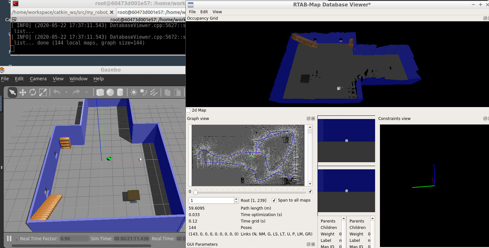
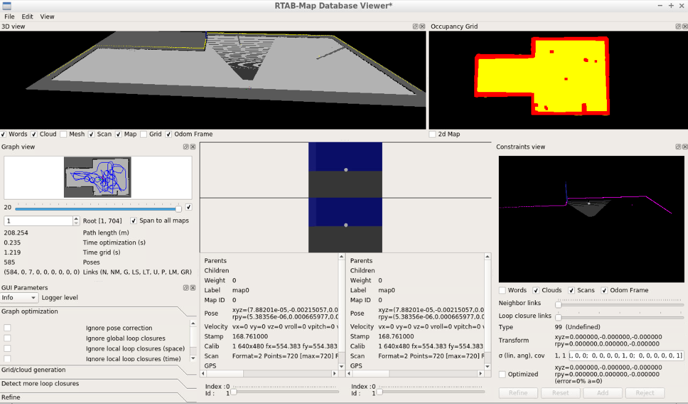

# Map my World Project - Robotics Udacity ND
## RTABMap ROS package to map a world in Gazebo as well as localiz

**Dependencies**

The robot uses the `rtabmap_ros` ROS package, that can be installed through `apt-get`.

Make sure you have all deps in your system running: `rosdep -i install rtabmap_ros`.

Follow the instructions here, depending on your ros version: [http://wiki.ros.org/rtabmap_ros]

**Clone repo**

Once you've created your `catkin_ws` workspace, inside `src` folder, clone this repo:

`cd ~/catkin_ws/src/`
`git clone https://github.com/diegoavillegasg/mapping-a-world`

**Build Package**

Standing out in `catkin_ws` folder, build the package:

`cd ~/catkin_ws`
`catkin_make`

**Load current workspace variables**

`source dev/setup.bash`

**Launching ROS nodes**

To start environment:
`roslaunch my_robot world.launch`

To launch the teleop node:
`roslaunch my_robot teleop.launch`

To launch SLAM node in mapping mode:
`roslaunch my_robot mapping.launch`

In folder `maps` you can find two maps created for this environment.

*Using `rtabmap.db` file*

  

*Using `rtabmap1.db` file*
  